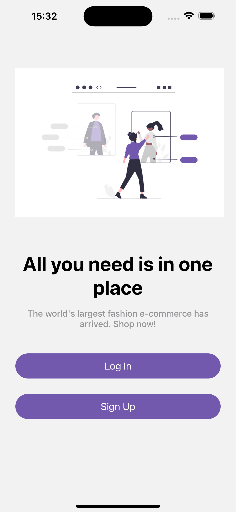
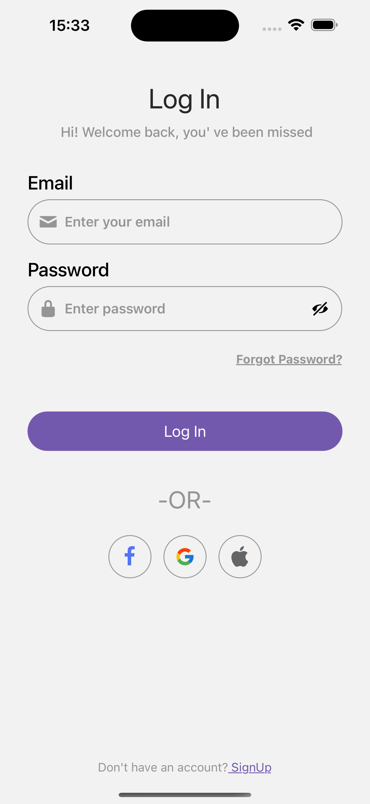
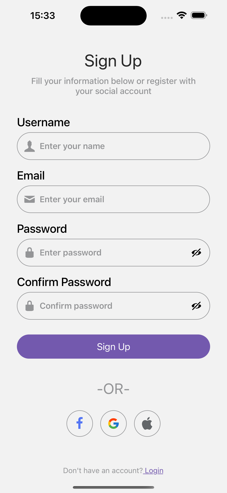
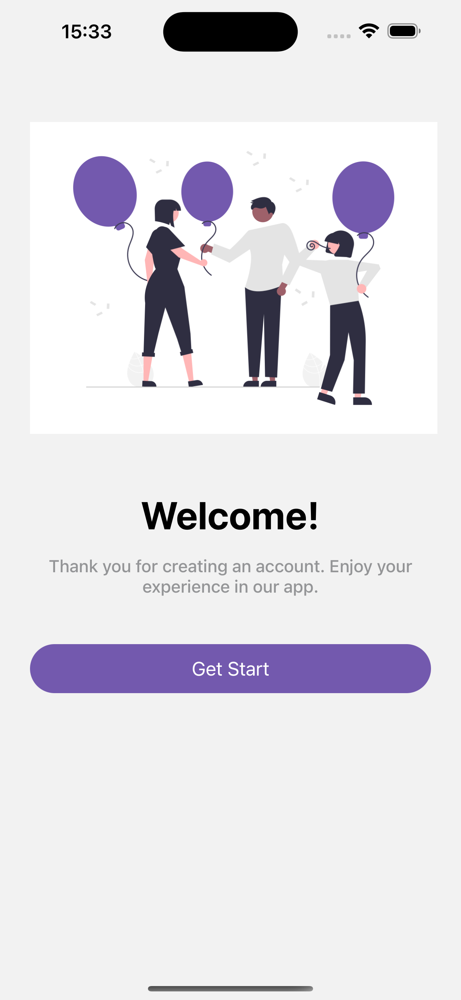

# Login Register Mobile Screen

React Native ile geliştirilmiş, giriş ve kayıt ekranlarına sahip bir mobil uygulama.

## 📄 Hakkında

Bu proje, kullanıcıların kolayca hesap oluşturabileceği veya var olan hesaplarına giriş yapabileceği bir mobil uygulamadır. Uygulama, kullanıcı dostu bir deneyim sunmayı hedefleyen, basit ve modern bir arayüz ile tasarlanmıştır.
## 🚀 Özellikler

- Giriş ve Kayıt ekranları
- Mobil cihazlar için duyarlı tasarım
- Ekranlar arasında kolayca gezinme

## 🛠️ Kullanılan Teknolojiler

- **React Native**: Çapraz platformlu mobil uygulamayı geliştirmek için.
- **React Navigation**: Ekranlar arasında gezinme işlevselliği için.
- **Expo**: React Native uygulamaları geliştirmek için.
- **expo-status-bar**: Durum çubuğunu yönetmek için.
- **react-native-safe-area-context**: Güvenli alanları yönetmek için.
- **react-native-screens**: Ekran yönetimini sağlamak için.

## ⚙️ Kurulum

1. Repositoriesi klonlayın:
    ```bash
    git clone https://github.com/busracogul/login-register-mobile-screen.git
    ```
2. Proje dizinine gidin:
    ```bash
    cd login-register-mobile-screen
    ```
3. Gerekli bağımlılıkları yükleyin:
    ```bash
    npm install
    ```
4. Uygulamayı başlatın:
    ```bash
    npm run start
    ```

## 📌 Referans

[Behance - Kayıt & Giriş Ekranları](https://www.behance.net/gallery/207716351/Sign-up-Login-Screens) tasarımından esinlenilmiştir.


## Proje Görselleri

<div style="display: flex; justify-content: space-around;">
  
  
  
  
</div>
